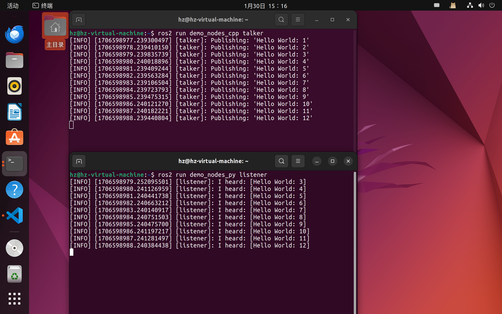
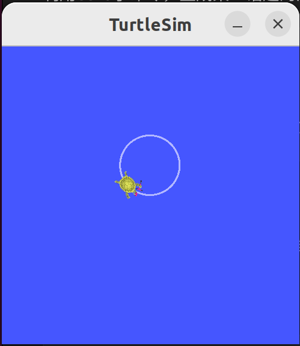
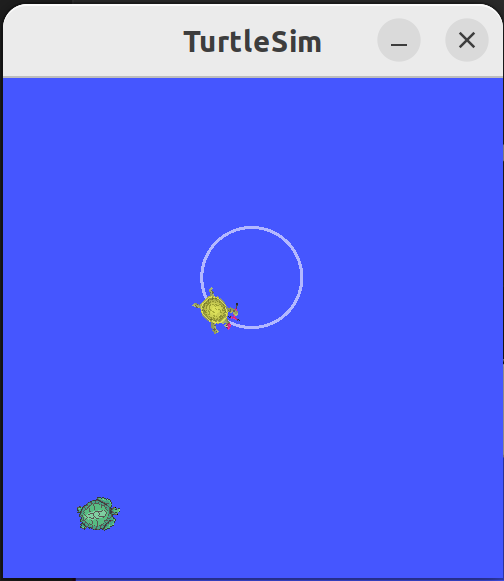

# Ros2
## 一、ros2的安装
### 1.1设置locale
* 根据文档描述只要是支持UTF-8的locale都可以
~~~
    sudo apt update && sudo apt install locales
    sudo locale-gen en_US en_US.UTF-8
    sudo update-locale LC_ALL=en_US.UTF-8 LANG=en_US.UTF-8
    export LANG=en_US.UTF-8
~~~
***
### 1.2设置Ubuntu软件源
#### 1.2.1首先确认是否存在已经启用的Universe源
    apt-cache policy | grep universe

返回可能有若干行，但是应该包含类似如下内容：
~~~
 100 https://mirrors.aliyun.com/ubuntu jammy-backports/universe i386 Packages
     release v=22.04,o=Ubuntu,a=jammy-backports,n=jammy,l=Ubuntu,c=universe,b=i386
 100 https://mirrors.aliyun.com/ubuntu jammy-backports/universe amd64 Packages
     release v=22.04,o=Ubuntu,a=jammy-backports,n=jammy,l=Ubuntu,c=universe,b=amd64
 500 https://mirrors.aliyun.com/ubuntu jammy-updates/universe i386 Packages
     release v=22.04,o=Ubuntu,a=jammy-updates,n=jammy,l=Ubuntu,c=universe,b=i386
 500 https://mirrors.aliyun.com/ubuntu jammy-updates/universe amd64 Packages
     release v=22.04,o=Ubuntu,a=jammy-updates,n=jammy,l=Ubuntu,c=universe,b=amd64
 500 https://mirrors.aliyun.com/ubuntu jammy-security/universe i386 Packages
     release v=22.04,o=Ubuntu,a=jammy-security,n=jammy,l=Ubuntu,c=universe,b=i386
 500 https://mirrors.aliyun.com/ubuntu jammy-security/universe amd64 Packages
     release v=22.04,o=Ubuntu,a=jammy-security,n=jammy,l=Ubuntu,c=universe,b=amd64
 500 https://mirrors.aliyun.com/ubuntu jammy/universe i386 Packages
     release v=22.04,o=Ubuntu,a=jammy,n=jammy,l=Ubuntu,c=universe,b=i386
 500 https://mirrors.aliyun.com/ubuntu jammy/universe amd64 Packages
     release v=22.04,o=Ubuntu,a=jammy,n=jammy,l=Ubuntu,c=universe,b=amd64
~~~
**如果没有包含类似上述的内容，那么执行如下命令：**
~~~
sudo apt install software-properties-common
sudo add-apt-repository universe
~~~
***
### 1.3添加Ros2 apt仓库
#### 1.3.1添加证书
~~~
sudo apt update && sudo apt install curl -y
sudo curl -sSL https://raw.githubusercontent.com/ros/rosdistro/master/ros.key -o /usr/share/keyrings/ros-archive-keyring.gpg
~~~
>这里可能会出问题，像
>>curl: (7) Failed to connect to raw.githubusercontent.com port 443: Connection refused 
>
>**直接去csdn搜吧！！！**前一天晚上出了问题的，第二天照着官网做了同样的步骤没有报错捏，很逆天qwq

####1.3.2添加ros仓库
~~~
echo "deb [arch=$(dpkg --print-architecture) signed-by=/usr/share/keyrings/ros-archive-keyring.gpg] http://packages.ros.org/ros2/ubuntu $(. /etc/os-release && echo $UBUNTU_CODENAME) main" | sudo tee /etc/apt/sources.list.d/ros2.list > /dev/null
~~~

### 1.4安装ros2包
**这里安装的是Desktop版本**
~~~
sudo apt update
sudo apt upgrade
sudo apt install ros-humble-desktop
~~~
>其他版本的安装可以参考[Ros2官网](https://docs.ros.org/en/humble/Installation/Ubuntu-Install-Debians.html)

### 1.5配置环境变量
~~~
source /opt/ros/humble/setup.bash
echo " source /opt/ros/humble/setup.bash" >> ~/.bashrc 
~~~

### 1.6测试
#### 1.6.1
打开第一个终端，启动一个数据的发布者节点：

    ros2 run demo_nodes_cpp talker

#### 1.6.2
打开第二个终端，启动一个数据的订阅者节点：

    ros2 run demo_nodes_py listener

#### 1.6.3
开启乌龟仿真

    ros2 run turtlesim turtlesim_node
再启动一个终端，运行

    ros2 run turtlesim turtle_teleop_key
用键盘控制乌龟运动

## 二、ROS2命令行操作
所有操作都集成在一个ros2的总命令中，后边第一个参数表示不同的操作目的，**比如node表示对节点的操作，topic表示对话题的操作**
### 2.1运行节点程序

    ros2 run 。。。
    
#### 例如运行海龟仿真节点和键盘控制节点

    ros2 run turtlesim turtlesim_node
    ros2 run turtlesim turtle_teleop_key

### 2.2查询节点信息
查看当前运行的ros2系统中都有哪些节点

    ros2 node list

##### 生成ros node的帮助文档
    ros2 node

利用info子命令，查看某一节点的详细信息
    
    ros2 node info 节点名称

    例如：
    ros2 node info /turtlesim 

### 2.3查看话题信息
查看当前系统中都有哪些话题
    ros2 topic list
##### 生成ros2 topic的帮助文档
    ros2 topic
利用echo子命令，生成某一话题的消息数据

    ros2 topic echo 话题名称
    
    例如：
    ros2 topic echo /turtle1/pose 

### 2.4发布话题信息
例:通过命令行发布话题指令来控制海龟，让海龟动起来 

    ros2 topic pub --rate 1 /turtle1/cmd_vel geometry_msgs/msg/Twist "{linear: {x: 2.0, y: 0.0, z: 0.0}, angular: {x: 0.0, y: 0.0, z: 1.8}}"

显示效果： 

### 2.5发送服务请求
例：产生新的海龟 
    
    ros2 service call /spawn turtlesim/srv/Spawn "{x: 2, y: 2, theta: 0.2, name: 'shuizao'}"
##### 生成ros2 service的帮助文档

    ros2 service
显示效果： 
>在这里，我生成了一个名为“shuizao”的新乌龟，若想控制这只乌龟，需要将接口名称改为/shuizao/······ 
具体接口名称可在**ros2 topic list**中查看 
例：
>>ros2 topic pub --rate 1 /turtle1/cmd_vel geometry_msgs/msg/Twist "{linear: {x: 2.0, y: 0.0, z: 0.0}, angular: {x: 0.0, y: 0.0, z: 1.8}}" 
>
>变为
>>ros2 topic pub --rate 1 /shuizao/cmd_vel geometry_msgs/msg/Twist "{linear: {x: 2.0, y: 0.0, z: 0.0}, angular: {x: 0.0, y: 0.0, z: 1.8}}"
### 2.6录制控制命令
录制

    ros2 bag record 节点名称
播放

    ros2 bag play 文件路径
例：录制并播放乌龟的运动路径

    ros2 bag record /turtle1/cmd_vel
    ros2 bag play rosbag2_2024_02_14-17_10_00/rosbag2_2024_02_14-17_10_00_0.db3

## 三、工作空间
>source /opt/ros/humble/setup.bash或source /opt/ros/humble/setup.sh用于获取ros2的安装。**在新建终端中没有输入这两个命令行无法实现ros2命令。**利用echo " source /opt/ros/humble/setup.bash" >> ~/.bashrc 将它写入./bashrc中后，在所有终端都会自动获取ros2安装

>source install/local_setup.sh用于获取工作区，利用echo " source ~/dxy/install/local_setup.sh" >> ~/.bashrc将它写入./bashrc中后，在所有终端都会自动获取该工作区（优先级最高）
### 3.1创建工作空间

    mkdir -p ~/dxy/src
    cd ~/dxy/src
    git clone https://github.com/ros/ros_tutorials.git -b humble
### 3.2自动安装依赖

    sudo apt install -y python3-pip
    sudo pip3 install rosdepc
    sudo rosdepc init
    rosdepc update
    cd ..
    rosdepc install -i --from-path src --rosdistro humble -y
### 3.3编译工作空间

    sudo apt install python3-colcon-ros
    cd ~/dxy/
    colcon build

### 3.4设置环境变量

    source install/local_setup.sh # 该工作空间仅在当前终端生效
    echo " source ~/dxy/install/local_setup.sh" >> ~/.bashrc # 该工作空间在所有终端均生效

## 四、创建一个软件包
### 4.1创建功能包

    ros2 pkg create --build-type <build-type> --license Apache-2.0 --node-name my_node <package_name>
>   **pkg**：表示功能包相关的功能； 
    **create**：表示创建功能包； 
    **build-type**：表示新创建的功能包是C++还是Python的，如果使用C++或者C，那这里就跟ament_cmake，如果使用Python，就跟ament_python； 
    **package_name**：新建功能包的名字。 

例如：

    cd ~/dxy/src
    ros2 pkg create --build-type ament_cmake --license Apache-2.0 --node-name my_node shuizao               # C++
    ros2 pkg create --build-type ament_python --license Apache-2.0 --node-name my_node shuizao               # Python

    现在你将在工作区src目录中拥有一个名为shuizao的新文件夹。

### 4.2编译功能包
在创建好的功能包中，我们可以继续完成代码的编写，之后需要编译和配置环境变量，才能正常运行：

    cd ~/dxy
    colcon build   # 编译工作空间所有功能包
    colcon build --packages-select <package_name>   #编译工作空间中指定名称的功能包，在功能包较多的情况下可以节省时间
    source install/local_setup.sh   #要使用新的软件包和可执行文件，首先要获取您的主要 ROS 2 安装。然后，从目录内部运行以下命令来获取工作区。由于设置了环境变量到./.bashrc文件中，打开一个新的终端就能完成上述操作
### 4.3使用软件包
输入指令
    
    ros2 run my_package my_node
终端返回

    Hi from my_package.
### 4.4功能包的结构
具体参考ros2官网文档https://docs.ros.org/en/iron/Tutorials/Beginner-Client-Libraries/Creating-Your-First-ROS2-Package.html 
**Python功能包** 
package.xml包含功能包的版权描述，和各种依赖的声明。

setup.py文件里边也包含一些版权信息，除此之外，还有“entry_points”配置的程序入口，教程里说后面回讲如何使用的

## 五、编写简单的发布者和订阅者 （Python）
接下来将创建节点，这些节点通过主题以字符串消息的形式相互传递信息。 这里使用的示例是一个简单的“说话者”和“倾听者”系统; 一个节点发布数据，另一个节点订阅主题，以便它可以接收该数据。
### 5.1创建软件包

    ros2 pkg create --build-type ament_python --license Apache-2.0 py_pubsub

### 5.2写入发布者节点
    cd dxy/src/py_pubsub/py_pubsub
    wget https://raw.githubusercontent.com/ros2/examples/iron/rclpy/topics/minimal_publisher/examples_rclpy_minimal_publisher/publisher_member_function.py
### 5.3添加依赖
使用文本编辑器打开package.xml 
如上一教程所述，请确保填写和标记\<description>\<maintainer>\<license>三个标签

    <description>Examples of minimal publisher/subscriber using rclpy</description>
    <maintainer email="2144654256@qq.com">hz</maintainer>
    <license>Apache-2.0</license>

在上面的行之后，添加与节点的 import 语句相对应的以下依赖项：
    
    <exec_depend>rclpy</exec_depend>
    <exec_depend>std_msgs</exec_depend>

### 5.4添加入口点
打开setup.py文件。将maintainer 、maintainer_email、description和license字段按照package.xml中的内容做如下更改：

    maintainer='hz',
    maintainer_email='2144654256@qq.com',
    description='Examples of minimal publisher/subscriber using rclpy',
    license='Apache-2.0',
在entry_points内的console_scripts字段中添加发布者的入口点如下：

    entry_points={
        'console_scripts': [
                'talker = py_pubsub.publisher_member_function:main',
        ],
    },
### 5.4检查setup.cfg
应自动正确填充文件的内容，如下所示：

    [develop]
    script_dir=$base/lib/py_pubsub
    [install]
    install_scripts=$base/lib/py_pubsub
### 5.5写入订阅节点

    cd dxy/src/py_pubsub/py_pubsub
    wget https://raw.githubusercontent.com/ros2/examples/iron/rclpy/topics/minimal_subscriber/examples_rclpy_minimal_subscriber/subscriber_member_function.py
### 5.6添加入口点
打开setup.py将订阅者节点的入口点添加到发布者的入口点下方,结果如下所示:
    
    entry_points={
        'console_scripts': [
                'talker = py_pubsub.publisher_member_function:main',
                'listener = py_pubsub.subscriber_member_function:main',
        ],
    },
### 5.7构建并运行
#### 5.7.1检查依赖项

    rosdep install -i --from-path src --rosdistro iron -y
#### 5.7.2编译新包

    colcon build --packages-select py_pubsub

>这里遇到一点小小的问题，估计是之前安装colcon时执行的命令行有问题。

>问题描述：执行colcon build --packages-select py_pubsub报错如下：

>
>解决方法：
    
    sudo apt install python3-colcon-common-extensions
#### 5.7.3获取安装文件
执行

    source install/setup.bash
>由于我们设置了环境变量，所以只要打开一个新的终端也是可以的

#### 5.7.4执行
打开一个终端，执行

    ros2 run py_pubsub talker

再打开一个终端执行

    ros2 run py_pubsub listener

## 六、节点
按照[古月居](https://book.guyuehome.com/ROS2/2.%E6%A0%B8%E5%BF%83%E6%A6%82%E5%BF%B5/2.3_%E8%8A%82%E7%82%B9/)的教程来就好了

## 七、话题
按照按照[古月居](https://book.guyuehome.com/ROS2/2.%E6%A0%B8%E5%BF%83%E6%A6%82%E5%BF%B5/2.4_%E8%AF%9D%E9%A2%98/)的教程来就好了 
#### 案例一：Hello World话题通信按照 [**五、编写简单的发布者和订阅者 （Python）**](#五编写简单的发布者和订阅者-python) 进行
#### 案例二：机器视觉识别
#### 案例三：机器视觉识别优化
ROS中集成了usb相机的标准驱动，我们可以通过

    sudo apt install ros-humble-usb-cam

来安装该驱动，无论你用什么样的相机，只要符合usb接口协议，就可以直接使用ROS中的相机驱动节点，发布标准的图像话题了。
### 话题命令行操作

    ros2 topic list                # 查看话题列表
    ros2 topic info <topic_name>   # 查看话题信息
    ros2 topic hz <topic_name>     # 查看话题发布频率
    ros2 topic bw <topic_name>     # 查看话题传输带宽
    ros2 topic echo <topic_name>   # 查看话题数据
    ros2 topic pub <topic_name> <msg_type> <msg_data>   # 发布话题消息

## 八、服务
按照[古月居](https://book.guyuehome.com/ROS2/2.%E6%A0%B8%E5%BF%83%E6%A6%82%E5%BF%B5/2.5_%E6%9C%8D%E5%8A%A1/)的教程来就好了 
#### 案例一：加法求解器
古月居教程在这里还没有详细叙述[创建自定义 msg 和 srv 文件](https://docs.ros.org/en/iron/Tutorials/Beginner-Client-Libraries/Custom-ROS2-Interfaces.html)和[实现自定义接口](https://docs.ros.org/en/iron/Tutorials/Beginner-Client-Libraries/Single-Package-Define-And-Use-Interface.html)的内容，可以点击链接前往ros2官方文档浏览。不过在[九、通信接口](#九通信接口)也会介绍，我觉得还是古月居的教程讲得更加清楚。

#### 案例二：机器视觉识别
### 服务命令行操作
    ros2 service list                  # 查看服务列表
    ros2 service type <service_name>   # 查看服务数据类型
    ros2 service call <service_name> <service_type> <service_data>   # 发送服务请求
## 九、通信接口
按照[古月居](https://book.guyuehome.com/ROS2/2.%E6%A0%B8%E5%BF%83%E6%A6%82%E5%BF%B5/2.6_%E9%80%9A%E4%BF%A1%E6%8E%A5%E5%8F%A3/)的教程来就好了 
### 接口命令行操作
    ros2 interface list                    # 查看系统接口列表
    ros2 interface show <interface_name>   # 查看某个接口的详细定义
    ros2 interface package <package_name>  # 查看某个功能包中的接口定义